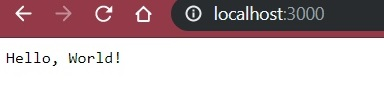
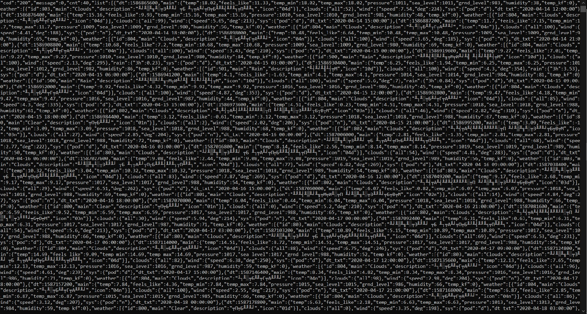

МИНИСТЕРСТВО НАУКИ  И ВЫСШЕГО ОБРАЗОВАНИЯ РОССИЙСКОЙ ФЕДЕРАЦИИ  
Федеральное государственное автономное образовательное учреждение высшего образования  
"КРЫМСКИЙ ФЕДЕРАЛЬНЫЙ УНИВЕРСИТЕТ им. В. И. ВЕРНАДСКОГО"  
ФИЗИКО-ТЕХНИЧЕСКИЙ ИНСТИТУТ  
Кафедра компьютерной инженерии и моделирования
<br/><br/>

### Отчёт по лабораторной работе №6<br/> по дисциплине "Программирование"
<br/>

студента 1 курса группы ПИ-б-о-191(2)
Щегловой Софии
направления подготовки 09.03.04 "Программная инженерия"  
<br/>

<table>
<tr><td>Научный руководитель<br/> старший преподаватель кафедры<br/> компьютерной инженерии и моделирования</td>
<td>(оценка)</td>
<td>Чабанов В.В.</td>
</tr>
</table>
<br/><br/>

Симферополь, 2020

## Лабораторная работа №6
Погодный информер\
\
**Цель:** 
1. Закрепить навыки разработки многофайловыx приложений;
2.Изучить способы работы с API web-сервиса;
3 Изучить процесс сериализации/десериализации данных.
\
**Ход работы:**\
**1\.** Скачиваем с  [гитхаба](https://github.com/yhirose/cpp-httplib) файлы httplib.h и json.hpp. Помещаем их в папку include в папку к нашему проекту и добавляем папку к проекту через свойства. Эти файлы необходимы нам для работы с сетью.
**2\.** Создаем данный нам в пример сервер для вывода Hellow word! на порт 3000. Проверяем его работоспособность.

**3\.** Информацию о погоде будем получать с сайтиа [openweathermap.org](https://openweathermap.org/). Заходим на него и регестрируемся.

**4\.** После регестрации получаем на mail письмо, содержащие наш API. Он не будет работать сразу, так что пока изучаем документацию с сайта.
Mой API: 285dc230435c808ed1515b2d0dbd9476.

**5\.** Изменяем программу так, чтоб видеть ответ от сайта. Получаем следущие:

**6\.** Для написания программы нужно ознакомиться с html файлом и понять форму, которую нам необходимо заполнить.

**6\.** Пишем код для решения поставленной задачи: 
```c++
#include <httplib/httplib.h>
#include <nlohmann/json.hpp>
#include <fstream>
#include <sstream>
#include <set>
#include <vector>

using namespace std;
using namespace nlohmann;
using namespace httplib;

char url[] = "api.openweathermap.org"; // Сайт и строку запроса задаем в виде массивов чаров
// Мой api 285dc230435c808ed1515b2d0dbd9476
char get_url[] = "/data/2.5/forecast?q=Simferopol&appid=285dc230435c808ed1515b2d0dbd9476&units=metric&lang=en";
// &units=metric меняет еденицы измерения
// &lang=en устанавливает язык

struct Data
{
    vector<string> data, temps, icon; 
    string city;
};

// Изменяем шаблонную строку значениями из массива 
void String_changer(string* t, string& substr, vector<string>& values);

string Icon_extract(const nlohmann::json& json);

string Float_To_String(float f);

Data parseData(const nlohmann::json& json);

void gen_response(const httplib::Request& req, httplib::Response& res);


int main(void)
{
    Server svr;                    // Создаём сервер
    svr.Get("/", gen_response);    // После обращения к нашему сайту вызываем функцию gen_response
    svr.listen("localhost", 3000); // Запускаем сервер на localhost и слушаем порт 3000
}

void String_changer(string* t, const string& substr, const vector<string>& values)
{
    size_t index = 0;
    int values_ind = 0;

    while (true) 
    {
        // Находим подстроку
        index = t->find(substr, index);
        if (index == string::npos) break;

        // Заменяем
        t->erase(index, substr.size());
        t->insert(index, values[values_ind]);

        values_ind++;
        if (values_ind >= values.size()) break;
    }
}

string Icon_extract(const json& json) // Получаем иконку
{
    auto weather = json["weather"];
    for (auto& el : weather.items())
    {
        return el.value()["icon"];
    }
}

string Float_To_String(float a) 
{
    stringstream new_string;
    new_string.precision(2);
    new_string << fixed << a;
    return new_string.str();
}

Data parseData(const json& json)
{
    vector<string> data, temps, icon;
    set<string> Checked_Date;

    auto city = json["city"]["name"].get<string>();
    auto list = json["list"];

    for (auto& el : list.items()) 
    {
        string date = el.value()["dt_txt"];
        date = date.substr(0, date.find(' '));

        if (Checked_Date.find(date) == Checked_Date.end())
        {
            data.push_back(date);

            auto temp = el.value()["main"]["temp"].get<float>();

            icon.push_back(Icon_extract(el.value()));
            temps.push_back(Float_To_String(temp));

            Checked_Date.insert(date);
        }
    }

    return { data, temps, icon, city };
}


void gen_response(const Request& req, Response& res) // Создаем ответ клиенту
{
    Client client(url, 80); // Инициализируем клиента

    auto weather_res = client.Get(get_url);
    if (weather_res->status == 200) // если получаем нужный статус, то начинаем работу
    {
        auto json = json::parse(weather_res->body);

        ifstream ifs("Template.html"); // открываем html файл

        string Template, buffer;
        while (getline(ifs, buffer))
        {
            Template += buffer + '\n';
        }

        Data data = parseData(json);

        // Меняем поля на полученные
        String_changer(&Template, "{city.name}", { data.city });
        String_changer(&Template, "{list.dt}", data.data);
        String_changer(&Template, "{list.weather.icon}", data.icon);
        String_changer(&Template, "{list.main.temp}", data.temps);
        res.set_content(Template, "text/html");
    }
    else
        res.set_content("Err", "text/plain");
}
```
**6\.** Проверяем результат:


**Вывод:** В ходе выполнения данной лабораторной работы я ознакомилась с принципами работы API, научилась изменять html файлы и создавать простейшие сервера.