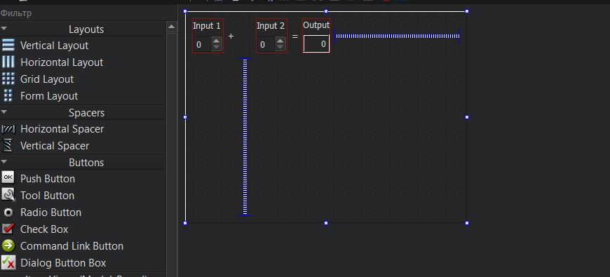

МИНИСТЕРСТВО НАУКИ И ВЫСШЕГО ОБРАЗОВАНИЯ РОССИЙСКОЙ ФЕДЕРАЦИИ\
Федеральное государственное автономное образовательное учреждение высшего образования\
"КРЫМСКИЙ ФЕДЕРАЛЬНЫЙ УНИВЕРСИТЕТ им. В. И. ВЕРНАДСКОГО"\
ФИЗИКО-ТЕХНИЧЕСКИЙ ИНСТИТУТ\
Кафедра компьютерной инженерии и моделирования\
<br/><br/>
​
### Отчёт по лабораторной работе № 7<br/> по дисциплине "Программирование"
<br/>

студентки 1 курса группы ПИ-б-о-191(2)\
Щегловой Софии\
направления подготовки 09.03.04 "Программная инженерия"\
<br/>
​
<table>
<tr><td>Научный руководитель<br/> старший преподаватель кафедры<br/>компьютерной инженерии и моделирования</td>
<td>(оценка)</td>
<td>Чабанов В.В.</td>
</tr>
</table>
<br/><br/>
​
Симферополь, 2019

* * *

## Цель: _изучить основные возможности создания и отладки программ в IDE Qt Creator_

## Ход работы

   ** 1. Создание консольного приложения С++ в IDE Qt Creator без использования компонентов Qt. **

Для создания консольного приложения С++ в IDE Qt Creator без использования компонентов Qt, нам необходимо зайти во вкладку Файл, Создать файл или проект, Проект без Qt, Выбрать приложение на языке C++ и ввести название проекта и путь.

\
*Рис.1 Проект без Qt*

  ** 2. Изменение цветовой схемы  среды. **

Цветовую схему в  Qt изменяем зайдя в Инструманты, Параметры, Сред, Интерфейс.
Я выбрала привычную мне темную тему.

\
*Рис.2 Изменение цветовой схемы*

   ** 3. Закомментирование/раскомментирование блока кода средствами Qt Creator. **

Комментирование выделенной части кода вQt Creator можно осуществить с помощую горячих клавиш *Ctrl + /* .

  ** 4. Открытие в проводнике Windows папки проекта с помощью Qt Creator. **

Для открытия папки с проектом жмем в Файл, Отрыть файл или проект.
Или нажимаем *Ctrl + O*.


   ** 5. Расширение файла-проекта в Qt Creator. **

В Qt Creator использует .pro  для файла проекта.

   ** 6. Запуск кода без отладки. **

Для запуска кода в режиме без отладки можно прибегнуть к одному из 3х способов:
1) Переходом на вкладку Сборка и жмем Запустить;
2) В левом нижнем углу и нажать на кнопку play без изображения жука;
3) Нажать *Ctrl + R*.

\
*Рис.3  кнопка без жука*

   ** 7. Запуск кода в режиме отладки. **

Запустить код в режиме отладки также можно тремя способами:
1) Нажав на Отладка, Начать отладку;
2) В левом нижнем углу и нажать на кнопку play с изображением жука;
3)  Нажатием кдавиши  *F5*.

\
*Рис.4 кнопка с жуком*

  ** 8. Установить/убрать breakpoint. **

Установить и убрать breakpoint можно нажав на область между кодом и номером нужной нам строки.

\
*Рис.5 Установка breakpoint*

   ** Пункт №9 **
 В QT мною была написана программа:
 ```c++
 #include <iostream>
int main() {
    int i;
    double d;
    i = 5;
    d = 5;
    std::cout << i << d;
    return 0;
}
 ```
 После я установила breakpoint на 5ой, 6ой и 7ой строках и запустила отладку.
 i в 5ой строке и d в 6ой содержали случайный набор цифр, а в 7ой в них были пятерки.

Значения переменных до инициализации отличаются, в разных компиляторах. После 7ой строчки отладчик qt показывал, что значение переменной b = 5, а в VS - b = 5.000000


  ** Пункт №10 ** 

Перешла на вкладку Начало, Примеры.

   ** Пункт №11 **
Выбрала готовый проект «Calculator Form Example».
\
*Рис.6 Calculator Form Example*

   ** Пункт №12 **
Прочитала описание выбранного проекта.

   ** Пункт №13 **
На вкладке «Проекты» был выбрн нужный комплект сборки.

   ** Пункт №14 **
Запустила проект на вкладке «Редактор».

   ** Пункт №15 **
Открыла файл «main.cpp». В нем установила курсор на слово «show» в строке calculator.show(); нажала *F1* и открылась справочная информация.
\
*Рис.7 Справочная информация*

   ** Пункт №16 **
В инспекторе проекта выбрала файл «Формы», «calculatorform.ui» и дважды кликнула по нему левой кнопкой мыши.
\
*Рис.8 Открытая форма*

   ** Пункт №17 **
В вкладку «Дизайн» на форме перевела английский текст на русский.
\
*Рис.9 Дизайн с новым текстом*


** Вывод: **
В ходе данной лабораторной работы я ознакомилась с программой IDE Qt Creator, сравнила ее с VS, научилась загружать готовые проекты и пользоваться вкладкой <<Дизайн>>