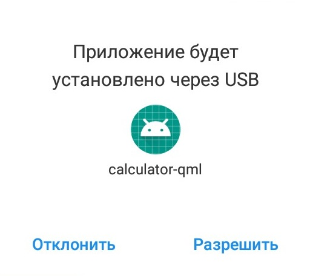

МИНИСТЕРСТВО НАУКИ И ВЫСШЕГО ОБРАЗОВАНИЯ РОССИЙСКОЙ ФЕДЕРАЦИИ\
Федеральное государственное автономное образовательное учреждение высшего образования\
"КРЫМСКИЙ ФЕДЕРАЛЬНЫЙ УНИВЕРСИТЕТ им. В. И. ВЕРНАДСКОГО"\
ФИЗИКО-ТЕХНИЧЕСКИЙ ИНСТИТУТ\
Кафедра компьютерной инженерии и моделирования\
  
​
### Отчёт по лабораторной работе № 8  по дисциплине "Программирование"
 

студентки 1 курса группы ПИ-б-о-191(2)\
Щегловой Софии\
направления подготовки 09.03.04 "Программная инженерия"\
 
​
<table>
<tr><td>Научный руководитель  старший преподаватель кафедры компьютерной инженерии и моделирования</td>
<td>(оценка)</td>
<td>Чабанов В.В.</td>
</tr>
</table>
  
​
Симферополь, 2020

* * *

## Цель: 
1. Настроить IDE Qt Creator для разработки приложений под android ОС;
2. Изучить базовые понятия связанные с мобильной разработкой;
3. Научиться создавать мобильные приложения при помощи фреймворка Qt 5.14.

## Ход работы

1. Скачала на свой компьютер файлы JDK 8.
2. Установила Android Studio.
3. В Android Studio в разделе с SDK качаю необходимые компоненты для работы с android.
4. В среде QT, в настройках android указала путь на скаченные JDK, SDK и NDK. Послу этого убедилась, что появилась зеленая галочка, означающая, что все компоненты найдены верно\
\
*Рис.1 Настройка Qt*
5. Из примеров Qt я выбрала калькулятор android (Qt SCXML Calculator QML Example).\
\
*Рис.2 Qt SCXML Calculator QML Example.*

6. Приложение будет запускаться на телефоне, подключенном по USB, по этому, когда в QT запустила отладку, мне нужно выбрать usb устройство. После этого подтвердить установку на самом телефоне.\
\
*Рис.3 Установка приложения на android телефон.*\
После установки на моем телефоне появился работающий калькулятор.\
\
*Рис.4 Скриншот запущенного калькулятора на телефоне.*

## Вывод
В ходе выполнения данной лабораторной работы я научилась устанавливать компоненты, необходимые для разработки на android, и настроила свою среду Qt для работы с телефоном, подключенным по usb.
